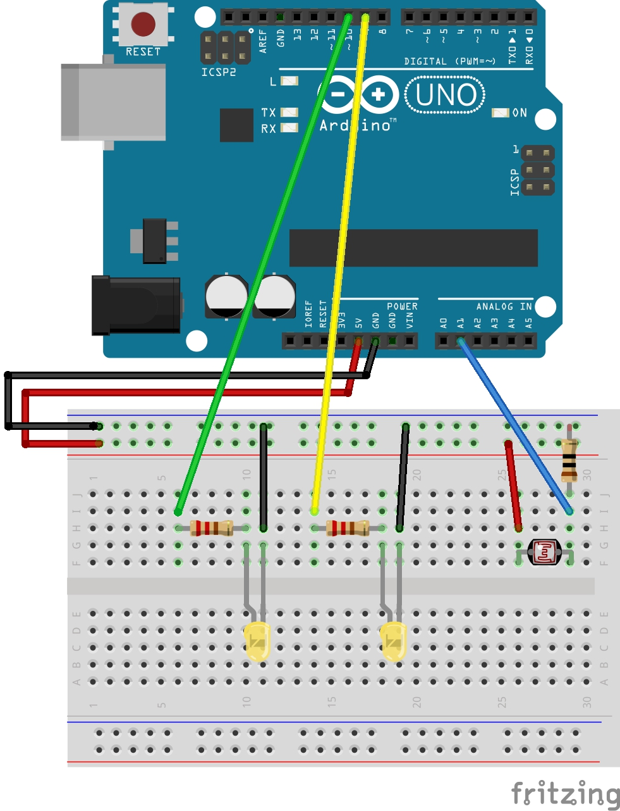

# Licht-Leben-Liebe
light-life-love

is a project to attach a LDR sensor to an Arduino Uno controller to light up LED´s in the case of low light contitions. 
# Hardware Required

Arduino Uno, LDR (Light Dependend Resistor), 2x LED, 2x 220 and 1x 10k ohm resistors,  Wires,  Breadboard

# Schematic diagram

